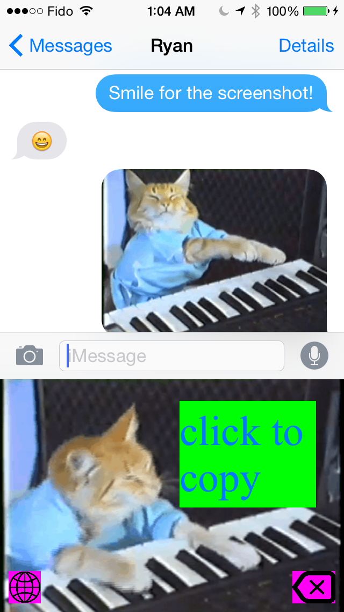

keyboard-cat
============

Keyboard Cat custom keyboard for iOS8 written in Swift.

## Installation

Build in Xcode.

## Usage

Run on at least iOS 8 (supports custom keyboards)

## Screenshot

## License

MIT
